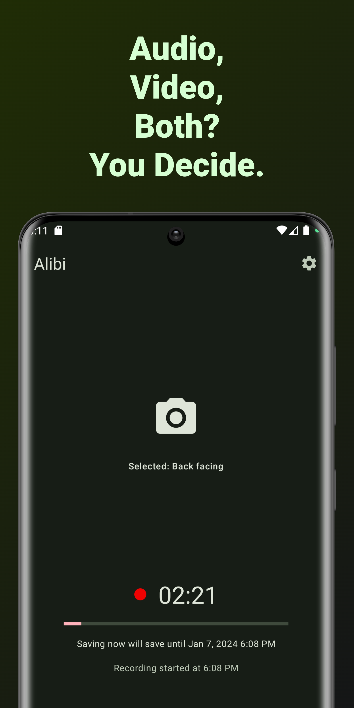
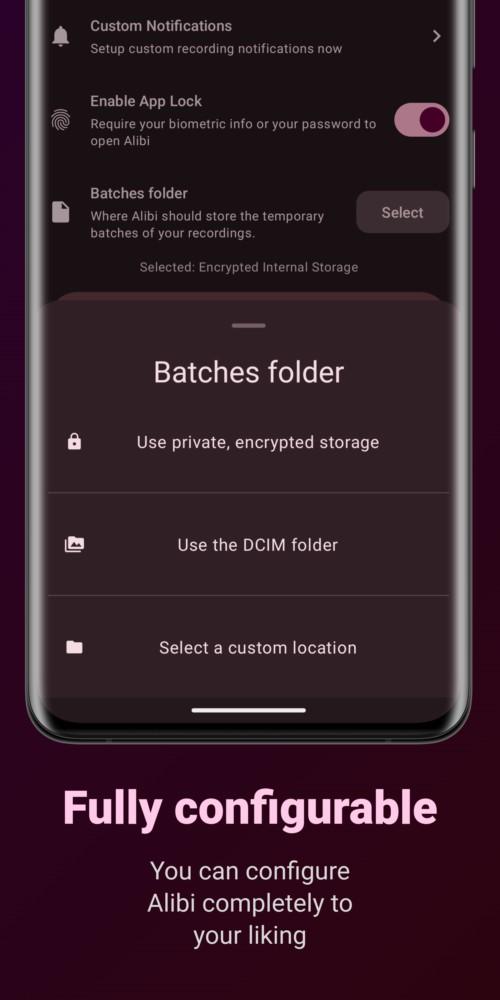
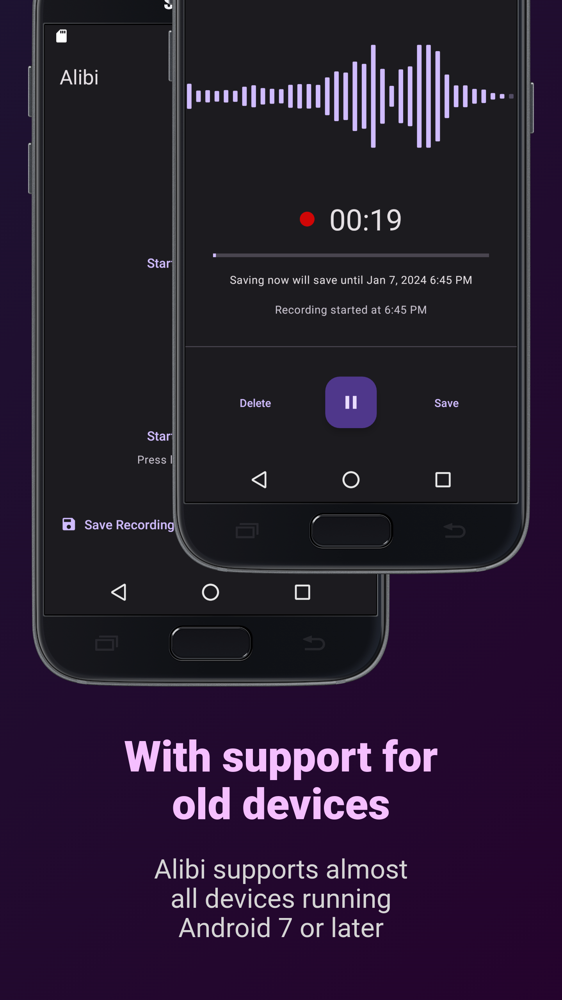

# Alibi

    
    
    
    
    
    

Alibi keeps recording in the background and saves the last 30 minutes at your request.
Everything is completely configurable. No internet connection required.

# Download

# Supporting Alibi

You can support Alibi in various ways:

## Contribute to the project

Add a new feature or fix bugs.

## Add translations

[Translate Alibi into your language using Crowdin](https://crowdin.com/project/alibi), so that other
people can use it more easily.

## Donate

It might sound crazy, but if you would just donate 1$, it would totally mean to world to me, since
it's a really small amount and if everyone did that, I can totally focus on Alibi and my other open
source projects. :)

You can donate via:

* [GitHub Sponsors](https://github.com/sponsors/Myzel394)
* Bitcoin: `bc1qw054829yj8e2u8glxnfcg3w22dkek577mjt5x6`
* Bitcoin Cash: `qr9s64vfqedvurfef9ykf7szchmt0xyvnga452fc8l`
* Ethereum: `0xbb5E631c03C65334d1d9EfBCD926DC1265CC20D7`
* Tether USD: `0xbb5E631c03C65334d1d9EfBCD926DC1265CC20D7`
*
Monero: `83dm5wyuckG4aPbuMREHCEgLNwVn5i7963SKBhECaA7Ueb7DKBTy639R3QfMtb3DsFHMp8u6WGiCFgbdRDBBcz5sLduUtm8`
* Zcash: `t1ZfvNpzfdaW6csT9Kc7iJA7LUU3hmNj2sx`
* Litecoin: `LZayhTosZ9ToRvcbeR1gEDgb76Z7ZA2drN`
* Dash: `XcTkni8CVAXBcuc5VwvHmsYftVK4CPLetU`
* Avalanche: `0xbb5E631c03C65334d1d9EfBCD926DC1265CC20D7`
* XRP: `rNpfDm8UwDTumCebchBadjVW2FEPteFgNg`
* Solana: `2h6CB3hz5Vb2nYS1RQiXZ4aWTzc5frBPR7Sp1b4muFqb`
*
ADA: `addr1q8vy2vcp6lacaw8lkc29gufuzajaytc5qc0c2mxlmw5lndxcg5esr4lm36u0lds523cnc9m96gh3gpsls4kdlkaflx6qf6qpvc`
* Dogecoin: `DUA4j7mVoc7Rvezu8YgeRKwxNuMzKeDoxD`
* Tron: `THWVLGhne5wDsGjd1CNenHDKQGzvGzrzLb`
* Polkadot: `1642iaR6AoKyM6qnnMHkfCRfRqRKJ2wC6Cm3UEWEFEz6EtZR`
* Cosmos: `cosmos1vt5z6rfj5sgnkdlddkuu8srw3xupyqxscva9hz`
* Algorand: `QBOQ6VSLMD77QEF33P5J3HKGOM5RZLNO6P5P3FTWCMQM3ORF6QY2W34KUI`
* Tezos: `tz1QUWNYuFqDibGCrwmkdaHSpTx3d6ZdxLMi`
* Litecoin: `LZayhTosZ9ToRvcbeR1gEDgb76Z7ZA2drN`
* Filecoin: `f1j6pm3chzhgadpf6iwmtux33jb5gccj5arkg4dsq`
