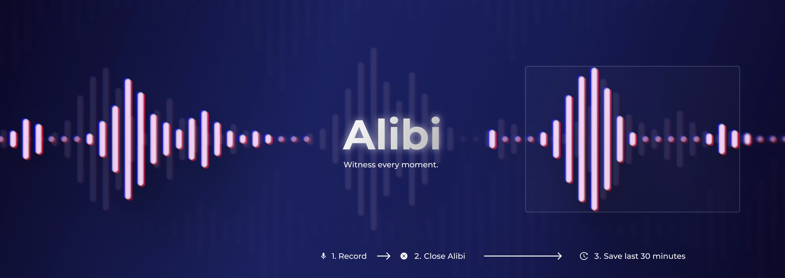
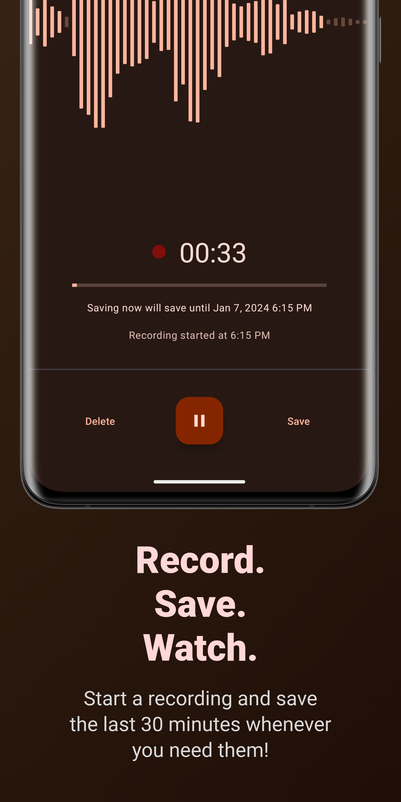
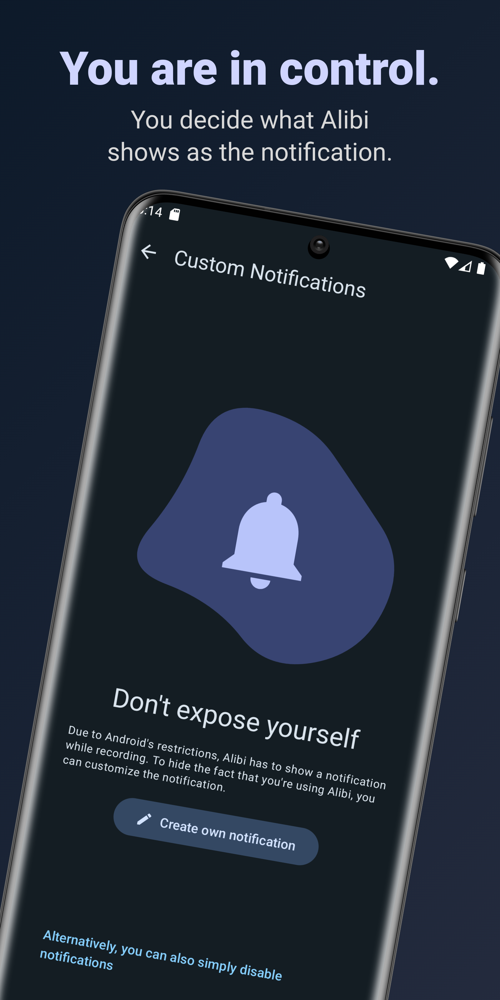
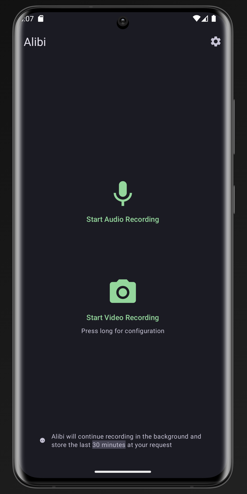

# Alibi

    
    
    
    
    
    

Alibi keeps recording in the background and saves the last 30 minutes at your request.
Everything is completely configurable. No internet connection required.

# Download

# Supporting Alibi

You can support Alibi in various ways:

## Contribute to the project

Add a new feature or fix bugs.

## Add translations

[Translate Alibi into your language using Crowdin](https://crowdin.com/project/alibi), so that other
people can use it more easily.

## Donate

It might sound crazy, but if you would just donate 1$, it would totally mean to world to me, since
it's a really small amount and if everyone did that, I can totally focus on Alibi and my other open
source projects. :)

You can donate via [GitHub Sponsors](https://github.com/sponsors/Myzel394) or via [crypto currencies](https://github.com/Myzel394/contact-me?tab=readme-ov-file#donations).
